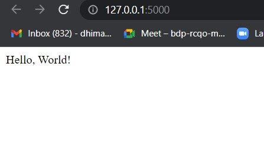
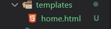

# Building a simple flask website

## Create a virtual Environment

1. installing virtual environment module -> `pip install virtualenv`
2. activate virtual environment -> `.\env\Scripts\activate.ps1 `

In case you see an error (restriction error)
go to powershell admin > run `Set-ExecutionPolicy unrestricted`

## Install packages

1.  `pip install flask`
2.  create a file 'app.py'
    write the boiler plate code

        from flask import Flask
        app = Flask(__name__)

        @app.route('/')
        def hello_world():
            return 'Hello, World!'

        if __name__ == '__main__':
            app.run(debug=True)

Voila! Your minimal flask application is ready.

Run python app.py

## Now, we will format our website.

Generating HTML from within Python is not fun, and actually pretty cumbersome because you have to do the HTML escaping on your own to keep the application secure. Because of that Flask configures the Jinja2 template engine for you automatically.

To render a template you can use the **render_template()** method. All you have to do is provide the name of the template and the variables you want to pass to the template engine as keyword arguments.

    from flask import render_template

    @app.route('/hello/')
    @app.route('/hello/<name>')
    def hello(name=None):
        return render_template('hello.html', name=name)

Flask will look for templates in the templates folder. So if your application is a module, this folder is next to that module, if it’s a package it’s actually inside your package

We have added a html file inside templates folder in root folder.

We imported render_template() method from the flask framework. render_template() looks for a template (HTML file) in the templates folder. Then it will render the template for which you ask.

Now, let's add another html page **about.html** inside templates folder.

Now we will render that in the app.py file.

    @app.route("/about)
    def about():
        return render_template("about.html")

## Let’s Connect Both Pages with a Navigation

